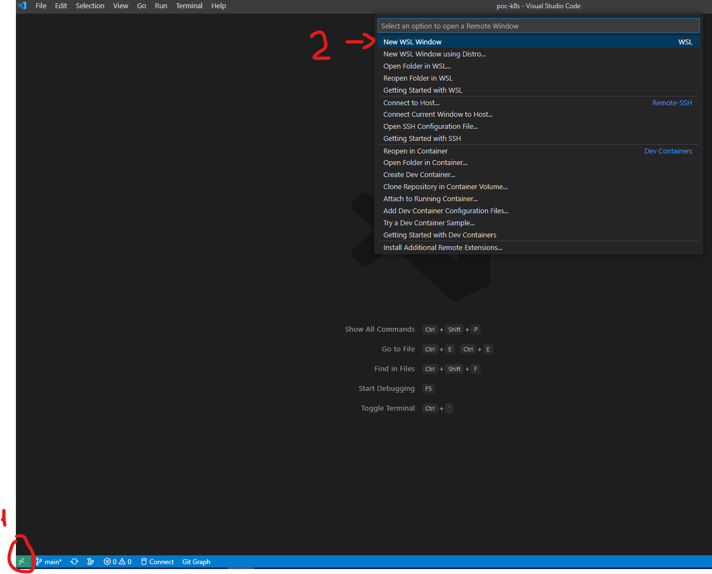

# poc-k8s

## Installation

- [install vscode](https://code.visualstudio.com/)
    - [add extension WSL](https://marketplace.visualstudio.com/items?itemName=ms-vscode-remote.remote-wsl)
- [Install Linux on Windows with WSL](https://learn.microsoft.com/en-us/windows/wsl/install)
    - ubuntu:22.04
    - wsl2
- Access wsl through vscode

- open a terminal
    - [install docker](https://nickjanetakis.com/blog/install-docker-in-wsl-2-without-docker-desktop)
    - [install minikube](https://minikube.sigs.k8s.io/docs/start/)
    - [generate ssh for github](https://docs.github.com/en/authentication/connecting-to-github-with-ssh/generating-a-new-ssh-key-and-adding-it-to-the-ssh-agent)
    - [add ssh to github](https://docs.github.com/en/authentication/connecting-to-github-with-ssh/adding-a-new-ssh-key-to-your-github-account)
    - clone the repo
    ```shell
    git clone git@github.com:devscheffer/poc-k8s.git
    ```

## Tools

- [x] Airbyte
- [ ] Airflow
- [ ] Spark
- [ ] S3
- [ ] Iceberg
- [ ] Snowflake