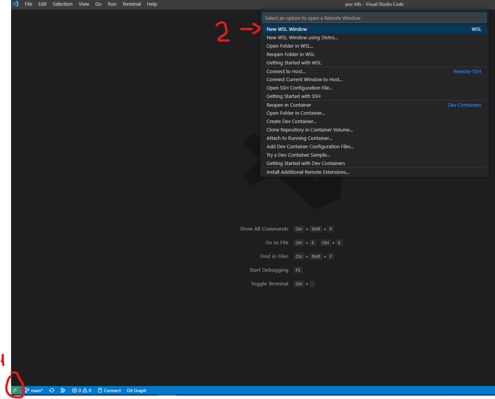

# poc-k8s

## Installation

- [install vscode](https://code.visualstudio.com/)
    - [add extension WSL](https://marketplace.visualstudio.com/items?itemName=ms-vscode-remote.remote-wsl)
- [Install Linux on Windows with WSL](https://learn.microsoft.com/en-us/windows/wsl/install)
    - ubuntu:22.04
    - wsl2
- Access wsl through vscode

- open a terminal
    - [install docker](https://nickjanetakis.com/blog/install-docker-in-wsl-2-without-docker-desktop)
    - [install minikube](https://minikube.sigs.k8s.io/docs/start/)
    - [install kubectl](https://kubernetes.io/docs/tasks/tools/install-kubectl-linux/)
    - [generate ssh for github](https://docs.github.com/en/authentication/connecting-to-github-with-ssh/generating-a-new-ssh-key-and-adding-it-to-the-ssh-agent)
    - [add ssh to github](https://docs.github.com/en/authentication/connecting-to-github-with-ssh/adding-a-new-ssh-key-to-your-github-account)
    - clone the repo
    ```shell
    git clone git@github.com:devscheffer/poc-k8s.git
    ```
    - [install helm](https://helm.sh/docs/intro/install/)

## Tools

- [x] Airbyte
- [x] Airflow
- [x] Spark
- [ ] S3
- [x] Iceberg
- [ ] Snowflake

# Documentation

https://jamesdefabia.github.io/docs/user-guide/kubectl/kubectl_explain/

```shell
kubectl explain <RESOURCE>
kubectl explain namespace
```

# From helm to kustomize

[ref](https://www.hoelzel.it/helm/2022/04/16/generate-kustomize-from-helm-chart.html)

./helm/kustomization.yaml
```yaml
apiVersion: kustomize.config.k8s.io/v1beta1
kind: Kustomization
namespace: default
helmCharts:
- name: airflow
  releaseName: airflow
  version: 1.7.0
  repo: https://airflow.apache.org
```

```shell
kubectl kustomize ./helm  --enable-helm >manifest.yaml

kubectl-slice -f manifest.yaml -o ./splited -t '{{.metadata.name}}-{{.kind | lower}}.yaml'

minikube service airflow-webserver
```

from the url

user: admin
pwd: admin


# from docker-compose to kustomize

```shell
kompose convert 
```

# dockerfile to k8

https://www.section.io/engineering-education/deploy-docker-container-to-kubernetes-cluster/

inside the folder containing the dockerfile
```shell
eval $(minikube docker-env)

docker build -t hello:v1 .

kubectl apply -k .

minikube tunnel
```
